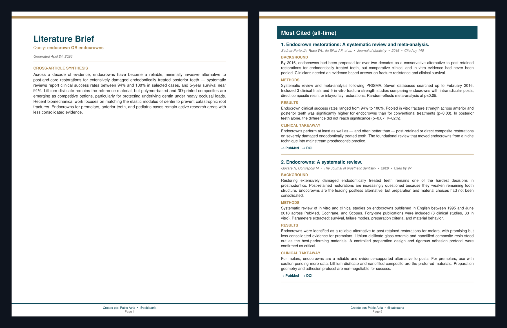

# pubmed-brief

> A Claude skill that turns any biomedical question into a branded PDF literature brief in about 60–90 seconds.

[](https://opensource.org/licenses/MIT)
[](https://docs.claude.com/en/docs/agents-and-tools/agent-skills)
[](https://www.python.org/downloads/)
[](./SECURITY.md)
[](https://github.com/pulls)

Ask Claude *"give me a literature brief on peri-implantitis"* and get back a multi-page PDF with the **5 most recent** and **5 most cited** peer-reviewed articles, each with a structured 4-part summary (Background / Methods / Results / Clinical Takeaway) and clickable links to PubMed, DOI, and PMC full text.



---

## Why this exists

Modern clinicians and researchers need to keep up with literature across multiple sub-specialties. The existing options are bad:

- **PubMed search** — gives you 200 results and an abstract. You still have to read, rank, and synthesize.
- **Google Scholar** — better citation data, no structured summaries, paywalls everywhere.
- **AI chatbots** — hallucinate citations or pull from training data that's months out of date.

`pubmed-brief` does the actual work: it queries the live PubMed/Europe PMC/Crossref APIs, ranks by both recency and citation count, fetches open-access full text where available, and asks Claude to write structured clinical summaries — then packages it all in a printable PDF you can share with colleagues, drop in a slide deck, or save for a journal club.

## What you get

For any topic you give it, a multi-page PDF containing:

- **Cross-article synthesis** — 80–120 word executive overview of the 10 papers
- **Most Recent (last 3 years)** — 5 articles sorted by publication date
- **Most Cited (all-time)** — 5 articles sorted by Europe PMC citation count
- **Per-article cards** with:
  - Authors, journal, year, citation count
  - Background / Methods / Results / Clinical Takeaway (~200 words total)
  - Clickable links to PubMed, DOI, and PMC full text (when open access)
- **Clean printable layout** suitable for clinical or academic use

See [`examples/example-endocrowns.pdf`](./examples/example-endocrowns.pdf) for a real output.

## Install (macOS / Linux)

**Requirements:** Python 3.10+ and Claude Code or Claude Desktop with skill support enabled.

```bash
# 1. Clone into your Claude skills directory
git clone https://github.com/pabloatria/pubmed-brief.git ~/.claude/skills/pubmed-brief

# 2. Install Python dependencies
cd ~/.claude/skills/pubmed-brief
./install.sh
```

That's it. The installer handles `biopython`, `reportlab`, and `requests` (with the `--break-system-packages` workaround for newer macOS Pythons).

## Use it

In Claude Desktop or Claude Code, just ask naturally:

```
"Give me a literature brief on guided implant explantation"
"What does the literature say about MODJAW and digital occlusion?"
"What does the evidence say about endocrowns?"
"Give me the latest research on Lithium Disilicate"
```

The skill auto-triggers, runs the search, writes summaries, and saves the PDF to `~/Downloads/`. Takes ~60–90 seconds.

## Use it without Claude (manual mode)

```bash
WORKDIR="${TMPDIR:-/tmp}"

# 1. Search and enrich
python3 scripts/search_articles.py \
  "oral microbiome AND periodontitis" \
  --email "your-email@domain.com" \
  --out "$WORKDIR/brief.json"

# 2. Write your own summaries.json (see SKILL.md Phase 3 for schema)
#    or feed brief.json to your preferred LLM

# 3. Generate PDF
python3 scripts/build_pdf.py "$WORKDIR/brief.json" \
  --summaries "$WORKDIR/summaries.json" \
  --out ~/Downloads/literature-brief.pdf
```

## How the search works

1. **PubMed (Entrez API)** — queries for two pools: 5 most recent (last 3 years, sorted by publication date) and 30 most relevant (all-time, sorted by PubMed's relevance algorithm).
2. **Europe PMC** — enriches every article with citation count (`citedByCount` field) and fetches open-access full text when available.
3. **Crossref fallback** — fills citation counts for articles Europe PMC doesn't index.
4. **Re-ranks the all-time pool** by citation count to produce the "Most Cited" section.

No API keys required. NCBI and Europe PMC TOS just need a contact email (configurable via `--email`).

## Customize

| Want | Change |
|---|---|
| More articles per section | `--per-section 7` |
| Different "recent" window | `current_year - 3` in `search_articles.py` → e.g. `current_year - 5` |
| Different brand colors | `TEAL` / `BRONZE` / `BEIGE` constants in `build_pdf.py` |
| Different default email | `--email` argparse default in `search_articles.py` |

## Network requirements

The script needs outbound HTTPS to:
- `eutils.ncbi.nlm.nih.gov` (PubMed)
- `www.ebi.ac.uk` (Europe PMC)
- `api.crossref.org` (citation fallback)

If you get HTTP 403, you're behind a restrictive firewall or sandbox — works fine on any home/office network.

## Limitations

- **Closed-access papers** fall back to abstract-only summaries. If the paper isn't in PMC open access, the summary quality is bounded by the abstract.
- **Citation counts lag Google Scholar** by weeks-to-months and undercount preprints. Europe PMC is more conservative but more reproducible.
- **Very new papers (<6 months)** will show near-zero citations everywhere. The "most cited" section is biased toward older, more established work — that's the point, but worth knowing.
- **Quality of summaries** depends on Claude reading carefully. If a summary is just an abstract paraphrase, ask Claude to redo it — the SKILL.md tells it not to, but it can happen.

## Security

This skill makes outbound HTTPS calls to PubMed, Europe PMC, and Crossref only. No credentials, no telemetry, no shell execution, no elevated privileges. All external content is escaped before rendering, and PDF hyperlinks are restricted to a strict URL whitelist.

Full threat model and mitigations: see [`SECURITY.md`](./SECURITY.md). To report a vulnerability privately, use a GitHub Security Advisory rather than a public issue.

If you don't trust the dependencies, install in a venv:
```bash
python3 -m venv ~/.pubmed-brief-venv && source ~/.pubmed-brief-venv/bin/activate
pip install biopython reportlab requests
```

## Repo structure

```
pubmed-brief/
├── SKILL.md              # The workflow Claude follows when the skill triggers
├── README.md             # This file
├── LICENSE               # MIT
├── SECURITY.md           # Threat model, dependencies, vulnerability disclosure
├── install.sh            # macOS/Linux dependency installer
├── preview-endocrowns.png # PDF screenshot for README
├── examples/
│   └── example-endocrowns.pdf
└── scripts/
    ├── search_articles.py    # PubMed + Europe PMC + Crossref pipeline (with input validation)
    ├── build_pdf.py          # Branded PDF generator (ReportLab, output-escaped)
    └── fonts/                # Bundled DejaVu Sans (public domain) for Unicode coverage —
                              # required for non-ASCII author names and Greek/math characters
                              # common in biomedical abstracts (β, μ, α, ≤). See fonts/LICENSE.
```

## Contributing

PRs welcome. Especially interested in:
- Bilingual output support (currently English-only)
- Additional ranking strategies (impact factor weighting, journal allowlists)
- A `.pkg`/`.dmg` installer for non-technical users
- Specialty-specific query templates (cardiology, orthopedics, etc.)

## License

MIT. Use it, fork it, ship it commercially, embed it in clinic software. Just don't blame me if a citation is wrong — verify before publishing anything.

## Author

Built by **Pablo J. Atria** — clinician-researcher, NYU College of Dentistry.

Originally built for daily use in research and clinical practice. Released publicly because there's no reason every clinician should rebuild this from scratch.

---

*If this saved you time, ⭐ the repo and tell a colleague.*
